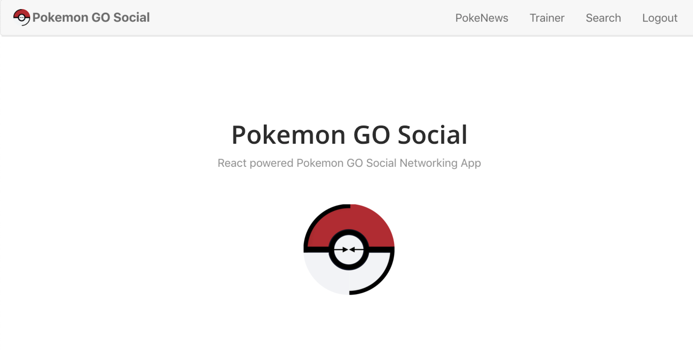
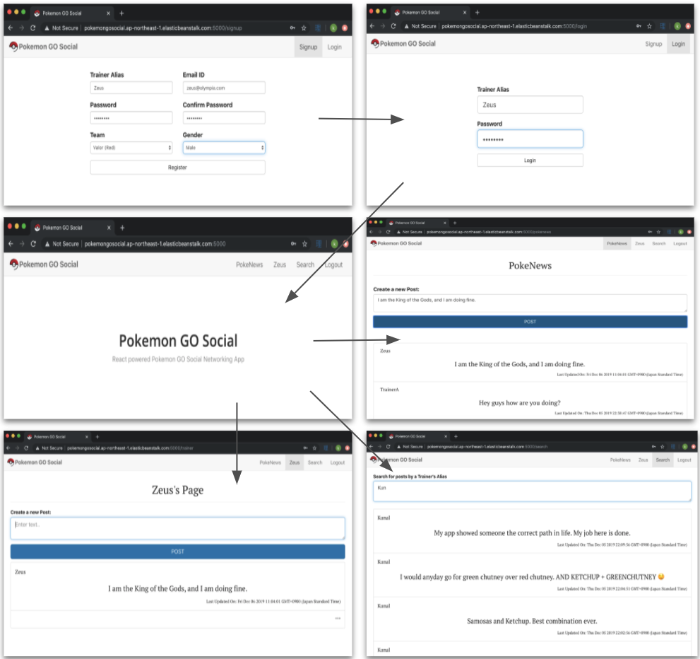
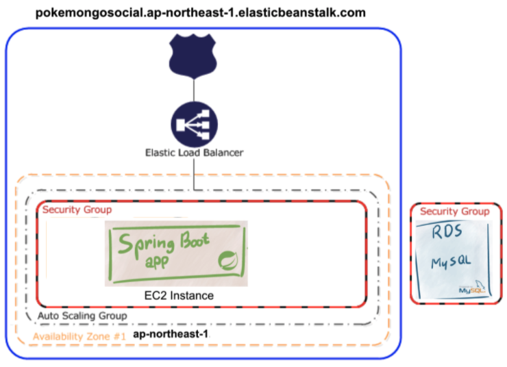

# Pokemon GO Social

Pokemon GO Social is to be a React powered Social Networking site for the Pokemon GO community for users to meet and play together to form new friendships on their journey - ***in the real world***.


## Contents

- [Website Screen Captures](#website-screen-captures)
- [Overview of Service](#overview-of-service)
- [Target Users](#target-users)
- [Value to Users](#value-to-users)
- [Tech Stack](#tech-stack)
- [Application flow](#application-flow)
- [DB Schema](#db-schema)
- [Infrastructure](#infrastructure)
- [Security](#security)
- [Monitoring](#monitoring)

## Website Screen Captures



## Overview of Service

- This social networking site is aimed at adding basic features such as making friends, 1-on-1 chat, news feed posts readable by friends and searching for other users, to supplement interaction in the Pokemon GO community.
- Trainers can register with their unique 12 digit (*for now-6*) Pokemon GO Trainer Codes.
- Like in the original app, friends can view information that includes your Alias, Avatar, Trainer level and XP, Buddy Pokémon name, Team, Number of Pokémon caught, Top 6 highest CP Pokémon, Distance Walked, and the Number of Battles won. Users also have the option to store a text-based introduction.
- The chat feature can be very important in various different scenarios. It gives a chance for the trainers to build interpersonal relationships with trainers they are playing with. Chatting may also be required to find people in case a group separates/spreads out while playing Pokémon GO.
- News feed can entertain posts such as snapshots of a Pokémon you are proud of having caught, or pictures of the raid group with whom you defeated a very difficult boss. Posts can also contain a section listing people who you were playing with, referencing their profiles.
- Like the original app, search can be based upon entering the trainer code if you have it, or just the usernames.

## Target Users

- 147 million monthly active Pokémon Go users worldwide in May 2018
- Crossed 1 billion downloads in September 2018; 500 million of these downloads occurred within the first three months after the game was released
- Pokémon Go dominates the location-based category of game, claiming an 84% market share in terms of downloads, and a 92% share in terms of revenue (as of December 2018)
- 60% of Pokémon Go users are aged 18-34 according to one measure; another finds 38% aged 19-34, with a further 32% aged 18 or younger. 43% of Pokémon Go users are female, so the user base is quite gender-equal.
- 35% increase in Pokémon Go usage when Niantic introduced some social features into the game.
- The game had made people walk 8.7 billion km collectively in 2016 – enough to get to the end of the Solar System.

## Value to Users

Why a social networking site for a social gaming app?

- In this increasingly social world, people make connections lying on their beds, rather than meeting people in person.
- Pokemon GO has already set records in making people get out of their homes and walk outside more than any other fitness app has.
- A social media focussed around Pokémon Go can help augment that success, since sometimes all it takes is a push to help someone start working out. Along with Pokemon, it can be people motivating people.
- It is often nice to walk together with someone and talk rather than just play alone.
- There can be events in the game powered by GO Social, which are designed specifically for trainers to interact with other trainers in the real world.
- Pokemon Go Social can actually have better impact than Facebook or other SNS, because the base of this social network is an app which *requires trainers to go out into the real world*.
- It might also lead to more interesting ways to play the game and I am sure Niantic must be looking for expanding its range of features, because of how Pokemon GO has been proving its longevity in the market.

## Tech Stack

- Backend/API
  - Java (SpringBoot)
    - Clean modular code and easy integration with Spring JDBC, Spring ORM, Spring Security
    - Most Boilerplate Code, Annotations and XML Configuration can be avoided
    - Documentation is excellent, and the community is helpful
- Database
  - MySQL
  - Spring JDBC is an API which provides drivers to access a database in Java
  - Hibernate
    - ORM Framework to map db tables to java classes using OOP concepts
    - Speedy and easy to scale
- Frontend/Client
  - React
    - Reusable components, uses JSX = HTML+JS
    - Quick rendering using Virtual DOM and update DOM using diff algorithm
    - Strong community
    - React-router and React-bootstrap
  - HTML/CSS/JS
- Deployment
  - Docker
  - AWS

## Application flow

```
├── SignUp
└── Login
    ├── Logout
    ├── PokeNews
    │   ├── Make a post
    │   └── View all posts
    ├── Trainer Profile
    │   ├── Edit Trainer Profile
    │   ├── View self posts
    │   ├── [TODO] View friend list
    │   └── [TODO] View friend profile
    ├── [TODO] Messaging
    │   ├── [TODO] View friend chat
    │   └── [TODO] Send message
    ├── Search
    └── [TODO] Add friend
```

## DB Schema

- trainer_cred (Entity: Trainer.java)
  - [M] Referenced by TrainerRepository
  - [V] Signup/Login page
- trainer_profile (Entity: TrainerProfile.java)
  - One-to-one mapping with trainer_cred
  - [M] Referenced by TrainerProfileRepository
  - [V] Trainer profile page
  - [C] Called by trainer_controller
- trainer_posts (Entity: Post.java)
  - Many-to-one mapping with trainer_cred
  - [M] Referenced by PostRepository
  - [V] Trainer/Search page
  - [C] Called by post_controller for PokeNews
- trainer_roles (Entity: Role.java)
  - Many-to-one mapping with roles
  - Many-to-many mapping with trainer_cred
  - Referenced by RoleRepository
  - Used for pre-authorization


## Infrastructure

- Local: Docker and localhost
- Production: AWS Beanstalk 



## Security

- [SpringBoot and React Security checklist](https://snyk.io/blog/spring-boot-security-best-practices/)
- Sql injection - Hibernate handles the database through class entities
- Passwords - min password length set to be 8 characters with BCrypt as hashing algorithm
- CSRF protection - JWT Tokens chosen instead of cookies so no need
- XSS
  - Spring: Enable content security policy headers
    - Setting [X-XSS-Protection: 1; mode=block] and [X-Frame-Options: DENY] in HTTP request headers
  - React
    - String variables in views are escaped automatically
    - With JSX you pass a function as the event handler, rather than a string that can contain malicious code
- Authorization - User and admin roles defined in backend

## Monitoring

- AWS CLOUDWATCH
- Logging Error/Events
  - Login attempts - user registered or not
  - Signup - user exist
  - Error in credentials
  - Login/Logout success/failure log
  - Post error log (post content/ lengths/ formats)
  - Forbidden requests
