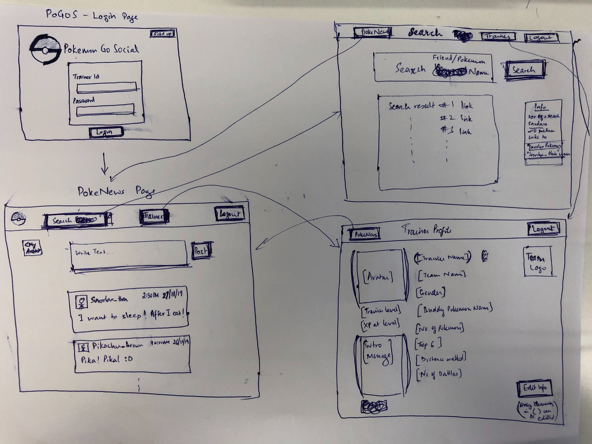
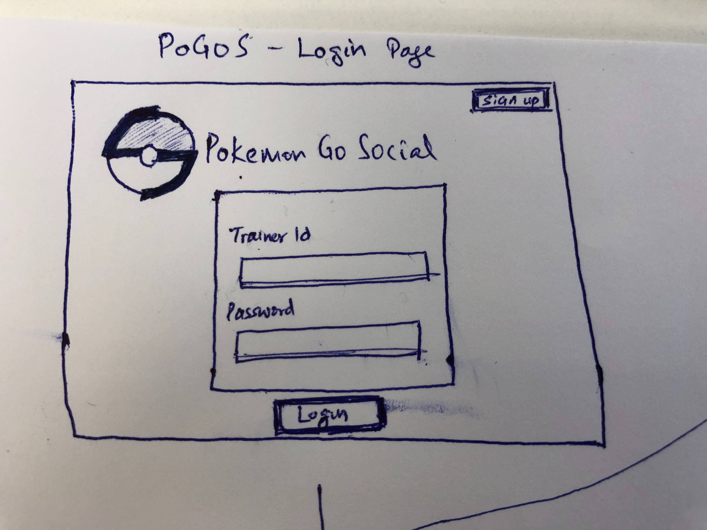
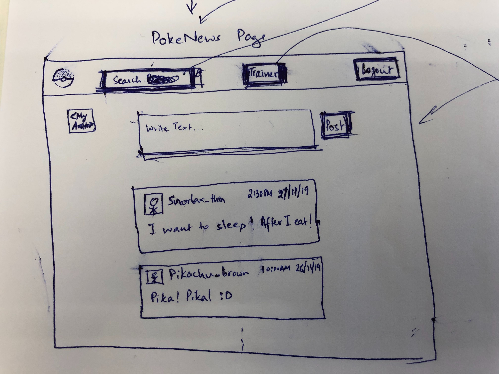
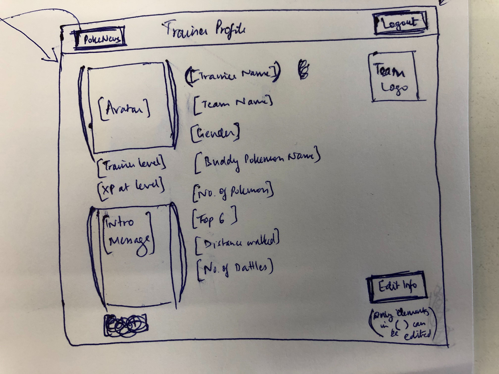
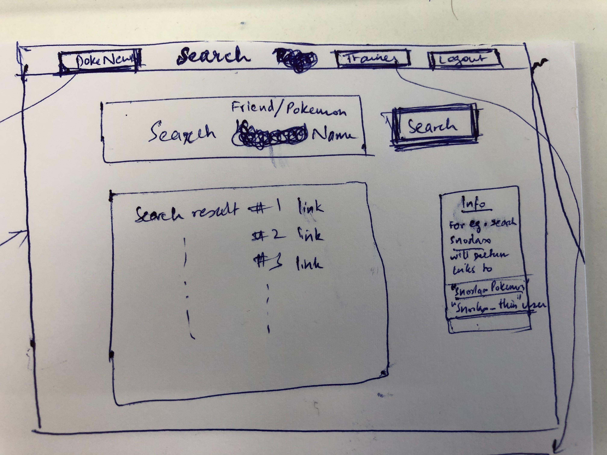
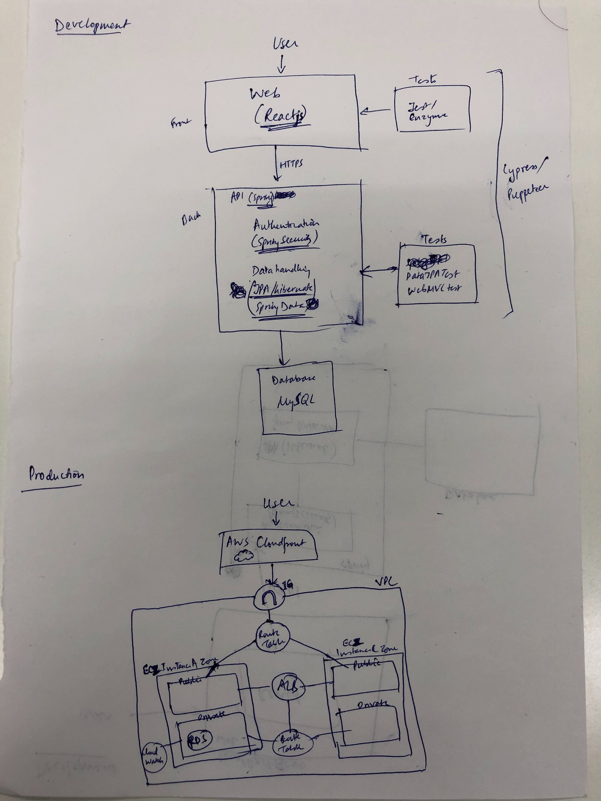

Pokemon GO Social
==================

Pokemon GO Social is to be a React powered Social Networking site for the Pokemon GO community for users to meet and play together to form new friendships on their journey - ***in the real world***.

## Target Users
* 147 million monthly active Pokémon Go users worldwide in May 2018
* Crossed 1 billion downloads in September 2018; 500 million of these downloads occurred within the first three months after the game was released
* Pokémon Go dominates the location-based category of game, claiming an 84% market share in terms of downloads, and a 92% share in terms of revenue (as of December 2018)
* 60% of Pokémon Go users are aged 18-34 according to one measure; another finds 38% aged 19-34, with a further 32% aged 18 or younger. 43% of Pokémon Go users are female, so the user base is quite gender-equal.
* 35% increase in Pokémon Go usage when Niantic introduced some social features into the game.
* The game had made people walk 8.7 billion km collectively in 2016 – enough to get to the end of the Solar System.

## Value to Users
 - In this increasingly social world, people make connections lying on their beds, rather than meeting people in person.
 - Pokemon GO has already set records in making people get out of their homes and walk outside more than any other fitness app has.
 - A social media focussed around Pokémon Go can help augment that success, since sometimes all it takes is a push to help someone start working out. Along with Pokemon, it can be people motivating people.
 - It is often nice to walk together with someone and talk rather than just play alone.
 - There can be events in the game powered by GO Social, which are designed specifically for trainers to interact with other trainers in the real world.
 - Pokemon Go Social can actually have better impact than Facebook or other SNS, because the base of this social network is an app which *requires trainers to go out into the real world*.
 - It might also lead to more interesting ways to play the game and I am sure Niantic must be looking for expanding its range of features, because of how Pokemon GO has been proving its longevity in the market.

## Overview of Service
- This social networking site adds basic features such as making friends, 1-on-1 chatting between friends, posting to a news feed readable by friends and searching for other users, as part of the Pokemon GO community.
- Trainers need to register with their unique 12 digit (*for now-6*) Pokemon GO Trainer Codes and generate a password during SignUp. During LogIn, the trainers can use their trainer codes and password to get to their profiles.
    - Add Alias (Username) login functionality later on
- Like in the original app, friends can view information that includes your Alias, Avatar, Trainer level and XP, Buddy Pokémon name, Team, Number of Pokémon caught, Top 6 highest CP Pokémon, Distance Walked, and the Number of Battles won. Users also have the option to store a text-based introduction.
- This app provides a chat feature between friends, which is very important in various different scenarios. It gives a chance for the trainers to build interpersonal relationships with trainers they are playing with. Chatting may also be required to find people in case a group separates/spreads out while playing Pokémon GO.
    - Add a feature later where location based temporary event chat rooms can be built, so that the chat can be used for groups to play together safely.
- News feed can entertain posts such as snapshots of a Pokémon you are proud of having caught, or pictures of the raid group with whom you defeated a very difficult boss. Posts can also contain a section listing people who you were playing with, referencing their profiles.
    - Tag notifications?
    - Commenting on posts can also be enabled later.
- Like the original app, search can be based upon entering the trainer code if you have it, or just the usernames.

## Framework / Tools
* Java (SpringBoot)
  - Spring is one of the most-maintained but complex MVC java frameworks available, so has a steep learning curve.
  - Documentation is excellent, and the community is helpful.
  - Enables us to write clean modular code for developing web apps and has well built security features to go with it - SpringData and SpringSecurity
  - SpringBoot is there to assist navigating through the complex framework easily using easy dependency management and auto configuration support
  - Play has a new version which is Play 2 and that doesn't have a lot of documentation or support yet.
* MySQL
* Hibernate
  - JPA provider/ORM Framework to deal with database access
  - Speed and being able to work with multiple databases
  - Easy to scale whatever software you are writing to bigger and smaller architectures and numbers of users
  - Slow to restart, but use with AWS should be better
* React
  - Simpler to grasp than Angular, uses JSX = HTML+JS
  - Reusability
  - One way data-binding, so easier to debug
  - Updates rendering of only updated elements instead of refreshing
  - Easy to test with Jest and Cypress/Puppeteer
* Docker
* AWS

## Overall Application flow
```
├── SignUp
└── Login
    ├── Logout
    ├── PokeNews
    │   ├── Make a post
    │   └── View all posts
    ├── Trainer Profile
    │   ├── Edit Trainer Profile
    │   ├── View self posts
    │   ├── View friend list
    │   └── View friend profile
    ├── Messaging
    │   ├── View friend chat
    │   └── Send message
    ├── Search
    └── Add friend
```
### Screen Transition Diagram


## Functions

[See Functions sheet](https://docs.google.com/spreadsheets/d/13vwGG_Eqmm5E5HBAxvim8XW88R8xTYjDdPpDuEH5pXU/edit?usp=sharing) **for Security/Logging/Testing related descriptions for each function**

#### Verbose Description
1. [SignUp](#SignUp) ---- LATER   
2. [**Login**](#Login)
    1. [**Logout**](#Logout)
    2. [**PokeNews**](#pokenews)
        1. [**Make a post**](#makepost)    
        2. [**View all posts**](#viewposts)   
    2. [**Trainer Profile**](#profile)   
        2. [**Edit Trainer Profile**](#editprofile)   
        2. [View self posts](#wall)    ---- LATER    
        2. [View friend list](#friendlist)    ---- LATER    
        2. [View friend profile](#friendprofile)   ---- LATER    
    2. [Messaging](#messaging) ---- LATER     
        2. [View friend chat](#chat)    ---- LATER     
        2. [Send message](#sendmsg)    ---- LATER     
    2. [**Search**](#search)
    2. [Add friend](#addfriend)     ---- LATER     


<a name="SignUp"></a>
#### SignUp ---- LATER
Input unique Pokemon GO ID (for now, any 6 digit unique number - later the actual 12 like in game) and EmailID and press "Register" button → if it is not registered already, then store locally and move to "Credentials" page. Generate:
- Trainer Alias
- Password
- Team Name (Instinct, Valor, Mystic)
- DOB
- Gender
If already stored, then display "Already registered" and a Go Back button to go to the PoGoS homepage.

<a name="Login"></a>

#### Login
Input valid Trainer ID and pre-generated password and press "Login" button → if it matches to DB data, then move "PokeNews" page. If Not, then display "TrainerID or Password is invalid"
 [Decide utf and password hashfunction security]

<a name="Logout"></a>
#### Logout
Press logout button in navigation bar of "PokeNews", "Trainer Profile" or the "Messaging" page and move to PoGoS Login page.

<a name="pokenews"></a>

<a name="makepost"></a>
#### PokeNews → Make a post
Navigate to the PokeNews page from the navigation bar available on the "PokeNews", "Trainer Profile" and "Messaging" Pages.
1. Posting block on top of the "PokeNews" page. It consists of a text box and an image icon and a "Post" button.  
2. To add text: Click into text box and add text into empty text box on the top of the PokeNews page.  
   To add image: Click image icon and upload image file path and press "Upload" button. *** <br>
3. Click Submit when happy with the post.  
4. Note down timestamp for post and add it to the post view along with the poster's alias.
5. Refresh PokeNews page.

<a name="viewposts"></a>
#### PokeNews → View all posts
Posts populated on the PokeNews page under the posting block chronologically from most recent to old posts. Post component is replicated to show n number of posts. Press [Older] or [Newer] to view other n post lists.

<a name="profile"></a>

<a name="editprofile"></a>
#### Trainer Profile → View/Edit Trainer Profile
Navigate to the "Trainer Profile" page from the navigation bar available on the "PokeNews", "Trainer Profile" and "Messaging" Pages.
1. Press the "Edit" button to go to the "profile edit form" page.
2. The Profile has the information:
    - Trainer Alias (set during signup: editable) (Text)
    - Team Name (set at signup: not changeable)(enum-> Instinct, Valor, Mystic)
    - Gender (set at signup: not changeable)(bool-> Male, Female)
    - Avatar (Editable) (Image)
    - Trainer Level (Updated directly if success getting from PoGO API)(Integer)
    - XP at trainer level (Updated directly if success getting from PoGO API)(Integer)
    - Buddy Pokemon Name (Updated directly if success getting from PoGO API)(Text)
    - Number of Pokémon caught (Updated directly if success getting from PoGO API)(Integer)
    - Top 6 highest CP Pokémon (Updated directly if success getting from PoGO API)(Text[6])
    - Distance Walked (Updated directly if success getting from PoGO API)(Integer)
    - Number of Battles won (Updated directly if success getting from PoGO API)(Integer)
    - Introductory Message (Editable)(Text)
3. After making changes, press "Submit" button → move to "Trainer Profile" page

<a name="wall"></a>
#### Trainer Profile → View self posts ---- LATER
Posts associated with the trainer are populated on the "Trainer Profile" page, in the posting section. Arranged chronologically from most recent to old posts. Post component is replicated to show n number of posts. Press [Older] or [Newer] to view other n post lists. Post component is exactly the same as the one used in PokeNews.

<a name="friendlist"></a>
#### Trainer Profile → View friend list ---- LATER
1. Press "Friends" on top of the "Trainer Profile" page and move to the "Friend List" page.
2. Friends of the user are displayed here in alphabetical order, along with their basic information:
      - Trainer Alias
      - Team Name
      - Level
      - Avatar (later)
      - Chat button directing to friend's chat.


<a name="messaging"></a>
<a name="chat"></a>
#### Messaging → View friend chat ---- LATER
Navigate to the "Messaging" page from the navigation bar available on the "PokeNews", "Trainer Profile" and "Messaging" Pages. Messaging page contains a list of friend chats referenced chronologically by the last message. There is also a search bar to start a new chat.
1. Press on chat button after selecting the friend's name from either history or the friend search
2. Move to friend chat page, which is populated with the chat messages in chronological order and color coded for the person who sent the message.
3. The chat page also has a back button to go back to the "Messaging page" and a send button to send a new text message.

<a name="sendmsg"></a>
#### Messaging → Send message ---- LATER
1. Type in the text in the text box.
2. Hit send -> refresh friend chat page to incorporate the latest message.
3. Hit back -> go back to the "Messaging" page, with refreshed order if new message sent.

<a name="search"></a>
### Search

Search for a friend's name on the Search page via trainer codes or trainer alias or by a Pokemon's name for a link to the Pokemon's details. If *Snorlax* is given as the search query, the search should return the link to the pokemon *Snorlax* and any trainer aliases which start with the string *Snorlax-*, such as *Snorlax_thin*.  
- Implement "add friend" from search results later

<a name="addfriend"></a>
### Add friend ---- LATER
Click add friend button on any new profile. New friends may have less information on the profile.


## DB Schema
Make actual DB schema using draw.io later

Trainer information, Trainer Posts, Trainer Friends are stored in DB

trainer_cred: Only login info (set after signup)
access: Holds session token and login information for security and logging purposes
trainer_info_basic: Only basic information which is common to most views
trainer_profile: All Pokemon GO related information regarding trainer
friends: Existing relationships between trainers (Later implement messaging)
posts: Holds post information to populate PokeNews


## Infrastructure



## Security
SpringBoot and React Security checklist (https://snyk.io/blog/spring-boot-security-best-practices/)
- Use HTTPS Let's Encrypt TLS certificates
- Sql injection - Hibernate + Placeholders
- Check dependency reliability
- XSS
  - Enable content security policy headers in Spring
  - use a meta http-equiv="Content-Security-Policy" tag in your HTML page
  - Use escapes
- CSRF - Spring Security enables CSRF Security by default. To work with React, you will need to configure the CookieCsrfTokenRepository so JavaScript can read the cookie
- Use spring vault for admin credentials if not local
- Use password hashing: PasswordEncoder in Spring. Also use salting
- Cookie: Attach HTTP-Only (+ Secure if using SSL/TLS) attribute to cookies that contain important information
- Use the latest modules, libraries, middleware, etc. as much as possible,
and do not use versions that release critical vulnerabilities.
- Don't expose framework information in meta tags/HTTP responses

Ask Saburi-san for more security pointers

## Monitoring & Logging
- AWS cloudwatch already has some monitoring and logging features.
- Using a client-side logging library sending JSON data to maintain a data structure that can easily be sorted and organized.

Logging- (Error/Events)
Login attempts - user registered or not
Signup - user exist
Error in credentials
Login/Logout success/failure log
Post error log (post content/ lengths/ formats)
Forbidden requests


## Test
Check custom unit tests in spreadsheet link above

- React - Jest + Enzyme for unit testing
- Spring - Have to check out DataJPATest, WebMvcTest
- Integration Testing with SpringBootTest
- E2E - Full UI Automatic tests using Cypress
